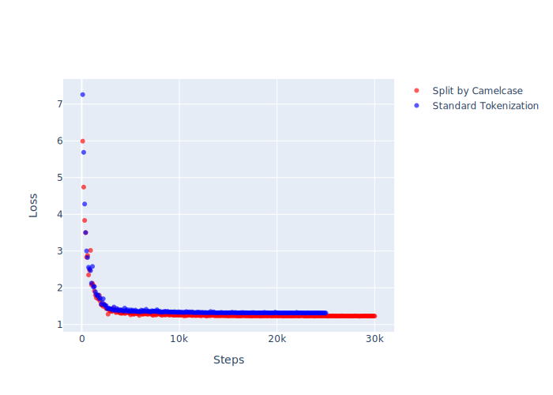
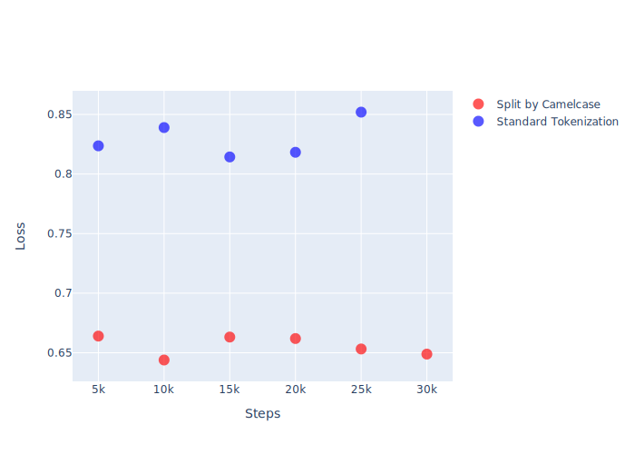
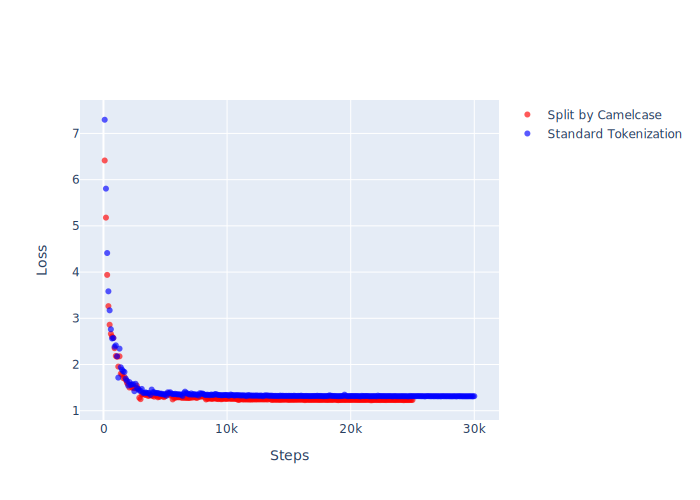
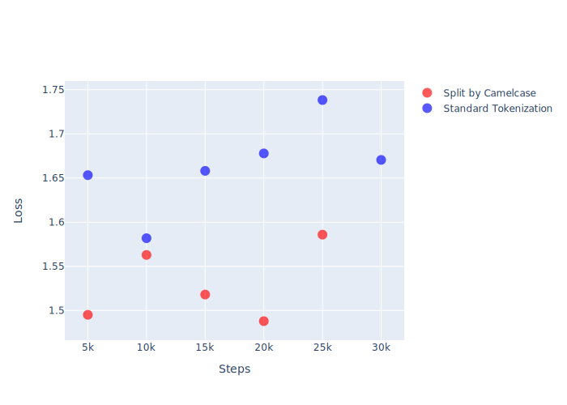

# Experiment

Each directory represents a different dataset. They all contain the same fixes and the differences can be read from the directory names. Each dataset also contains metadata files for further information on the data. All files were generated with [finalize_tokenized_dataset.py](/finalize_tokenized_dataset.py). Each dataset also contains results from one or more experiments of neural learning.

## Reading directory names

1. Imitation vs Extrapolation
   * Imitation: Train, val & test dataset are *randomly* chosen from aggregate dataset, thereby having overlapping diagnostics
     * train_perc = 60% of datapoints
     * val_perc = 20% of datapoints
     * test_perc = 20% of datapoints
   * Extrapolation: Train, val & test dataset have unique sets of diagnostics
     * train_perc = 70% of diagnostics
     * val_perc = 20% of diagnostics
     * test_perc = 10% of diagnostics
2. Max number of FILE_CONTENT tokens in input (required lines + context)
3. Tokenization method of identifiers
   * Standard (webHandler --> webHandler)
   * Splitting by camelcase (webHandler --> web Handler)
   * Zero-indexing (webHandler --> VAR-0)
4. Raw dataset version

## Possible Independent Variables

✔︎: Generated dataset, ✔︎✔︎: Trained model

* FINALIZING_DATASET: Mixture of train, val & test dataset
  * Randomly mixed to measure **imitation** learning ✔︎✔︎
  * Selecting diagnostics exclusively for test-set to measure **extrapolation** learning ✔︎✔︎
* NEURAL_NETWORK: Filter datapoints for limited number of source & target tokens in train
  * Max number of source & target tokens ✔︎✔︎
  * No restrictions ✔︎✔︎
* TOKENIZATION: Distribution of number of context tokens before & after required lines
  * Evenly split prepending and appending tokens to required lines ✔︎✔︎
    * Con: NN could learn to evenly subtract tokens at the beginning and end, until n number of full lines are left; If more than one line, it knows how many lines to remove through REMOVE/REPLACE
    * Pro: Still better than simply adding constant number of context lines, which is even easier to count
  * Random distribution of prepending and appending tokens
    * Pro: NN may have to learn more about dependencies between tokens to understand where to place its diff and which diff action to apply
* TOKENIZATION: Separating variable names / identifiers between camel cases ✔︎✔︎
  * Assumption: "Understanding" variable names; establishing connections between them
  * Pro: Enables NN to predict **unseen** identifier changes
  * Pro: Potentially reducing src/tgt space
  * Con: Increasing number of tokens
  * Example: Diagnostic VSD0001 in NuGet VSDiagnostics.1.10.0, stating "Asynchronous methods should end with the -Async suffix.", will add "Async" to method names. If not separated by camel case, the NN cannot learn to fix new method names, as every method name will be an entirely new representation in the src/tgt space.
* FINALIZING_DATASET: Randomly masking/removing diagnostic line number in input
  * Assumption: The NN may develop a better understanding of the code as it has to guess where the error is.
  * Pro: Can potentially be a helpful model in the evaluation by removing the final layer in the NN. Solely diagnostic messages can be fed to the NN and then their hidden representations can be calculated. May be an interesting analysis to calculate nearest neighbours.
* TOKENIZATION: Indexing variable names / identifiers
  * Assumption: In the majority of cases, static analyzers do not require naming for their fixes. Identifier names can therefore be regarded as unnecessary noise to the NN and it will therefore perform better when indexing identifiers.
  * Pro: Massively reducing src/tgt space
  * Con: No chance of changing identifier names in real applications
* FINALIZING_DATASET: Randomly masking diagnostic in input
  * Assumption: The NN may develop an understanding what is "good"/"bad" code. However, this is not the goal to be achieved, as it should soley learn how to translate a message into a code change.

## NN - How To

### Setup CUDA on Windows

```Command
SET PATH=C:\Program Files\NVIDIA GPU Computing Toolkit\CUDA\v11.2\bin;%PATH%
SET PATH=C:\Program Files\NVIDIA GPU Computing Toolkit\CUDA\v11.2\extras\CUPTI\lib64;%PATH%
SET PATH=C:\Program Files\NVIDIA GPU Computing Toolkit\CUDA\v11.2\include;%PATH%
SET PATH=C:\Users\vlohse\Desktop\cuDNN\bin;%PATH%
```

or

```Powershell
$PATH = [Environment]::GetEnvironmentVariable("PATH")
$new_path = "C:\Program Files\NVIDIA GPU Computing Toolkit\CUDA\v11.2\bin"
[Environment]::SetEnvironmentVariable("PATH", "$PATH;$new_path")

$new_path = "C:\Program Files\NVIDIA GPU Computing Toolkit\CUDA\v11.2\extras\CUPTI\lib64"
[Environment]::SetEnvironmentVariable("PATH", "$PATH;$new_path")

$new_path = "C:\Program Files\NVIDIA GPU Computing Toolkit\CUDA\v11.2\include"
[Environment]::SetEnvironmentVariable("PATH", "$PATH;$new_path")

$new_path = "C:\Users\vlohse\Desktop\cuDNN\bin"
[Environment]::SetEnvironmentVariable("PATH", "$PATH;$new_path")

```

### OpenNMT Commands

```Powershell

# Source and target vocabulary is highly related, so bundle it into one file:
onmt-build-vocab --tokenizer_config config/tokenizer.yml --size 50000 --save_vocab data/vocab.txt `
    data/src-train.txt `
    data/src-test.txt `
    data/src-val.txt `
    data/tgt-test.txt `
    data/tgt-train.txt `
    data/tgt-val.txt

onmt-main --model_type Transformer --config data.yml --auto_config train --with_eval

onmt-main --model_type Transformer --config data.yml --auto_config infer --features_file data/src-test.txt --predictions_file data/inference-test.txt
```

### Comparing Training Steps

* v3 Datasets
* Tensorflow Transformer Model

#### Imitation Experiments





#### Extrapolation Experiments




