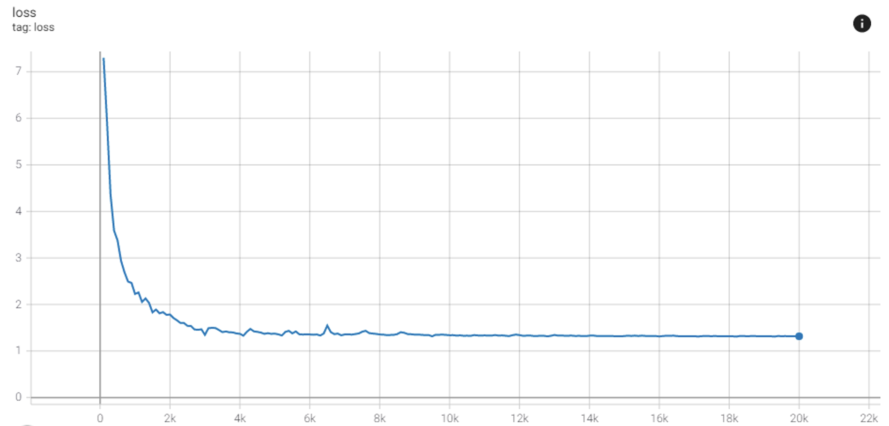
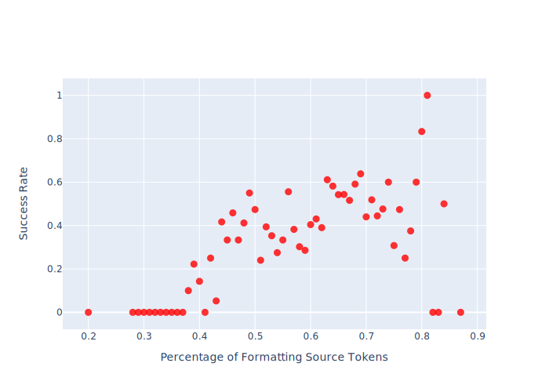
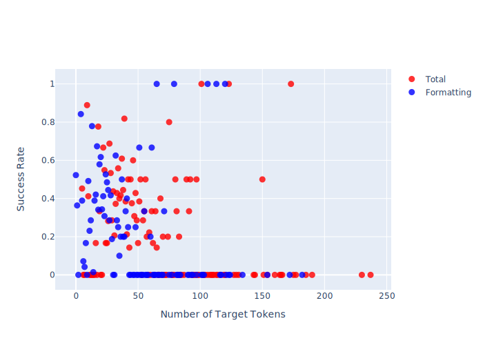

# Results and Evaluation

## Experiment Setup

* NN model: Out-of-the-box OpenNMT Transformer with SelfAttentionDecoder
* Max number of input tokens in training (Diagnostic Message + FILE_CONTENT): 350 (more than largest datapoint)
* Max number of output tokens in training: 500 (more than largest datapoint)
* See further NN parameters in [nn/data.yml](nn/data.yml)
* Hardware: Nvidia GeForce GTX 1080
* NN was evaluated on inferring/translating the test dataset
* Input: [src-test.txt](../src-test.txt), correct output: [tgt-test.txt](../tgt-test.txt), predicted output: [inference-test.txt](inference-test.txt)
* Evaluation was scripted in [evaluate_nn_results.py](/evaluate_nn_results.py)
* Evaluation results to be found in [inference-eval.json](inference-eval.json)
* Humanly readable output examples are saved in [characteristic_examples](characteristic_examples) and in [per_diagnostic_examples](per_diagnostic_examples)

## Results after n steps

Convergence after 5k steps (3h 16min); Loss function:

### Influence of Percentage of **Formatting** Tokens in Source on Success Rate of Predictions

### Influence of Percentage of **Formatting** Tokens in Target on Success Rate of Predictions

### Influence of Number of **Formatting** Tokens in Source on Success Rate of Predictions

The influence of total tokens in source is omitted, since the number of file context tokens for input is held constant.

### Influence of Number of Tokens in Target on Success Rate of Predictions

