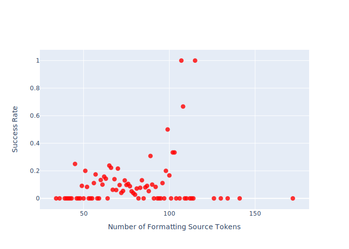
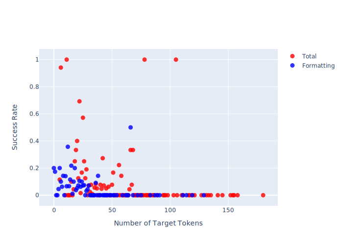

# Results and Evaluation

## Experiment Setup

* Hardware: Nvidia GeForce GTX 1080
* NN was evaluated on inferring/translating the test dataset
* Input: [src-test.txt](../src-test.txt), correct output: [tgt-test.txt](../tgt-test.txt), predicted output: [inference-test.txt](inference-test.txt)
* Evaluation was scripted in [evaluate_nn_results.py](/evaluate_nn_results.py)
* Evaluation results to be found in [inference-eval.json](inference-eval.json)
* Humanly readable output examples are saved in [characteristic_examples](characteristic_examples) and in [per_diagnostic_examples](per_diagnostic_examples)

## Results after n steps

Convergence after xk steps (yh zmin); Loss function:

### Influence of Number of **Formatting** Tokens in Source on Success Rate of Predictions

The influence of total tokens in source is omitted, since the number of file context tokens for input is held constant.

### Influence of Number of Tokens in Target on Success Rate of Predictions

