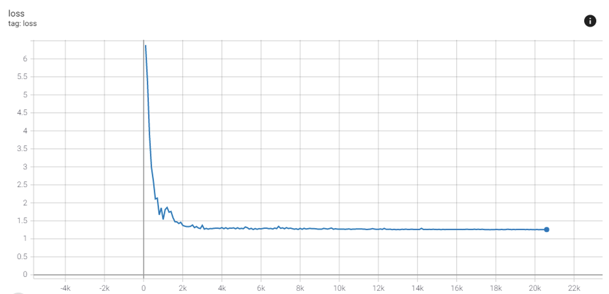
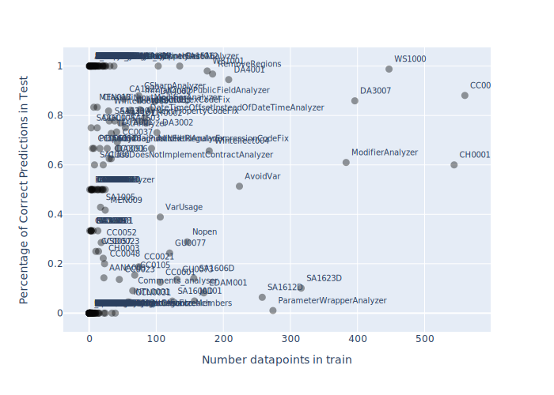
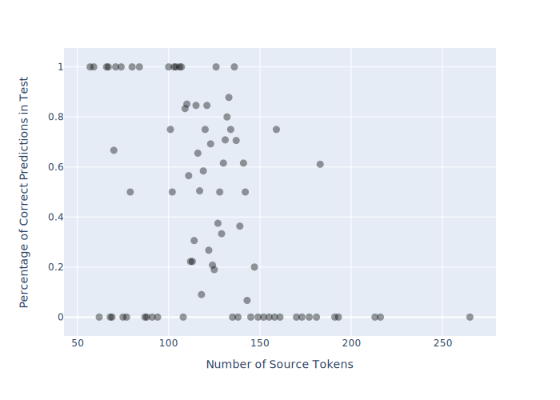
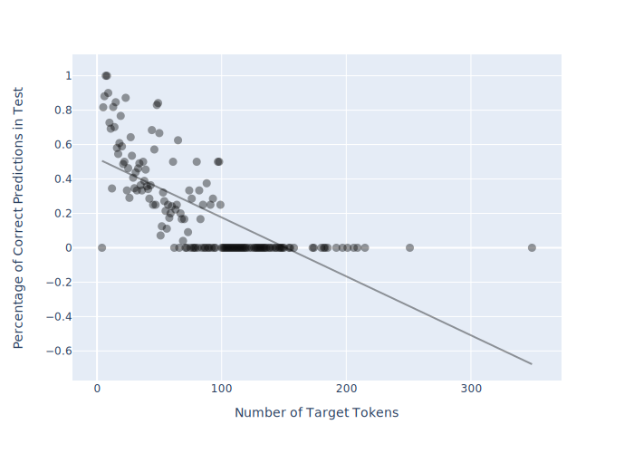
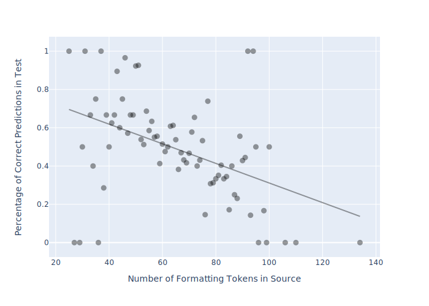
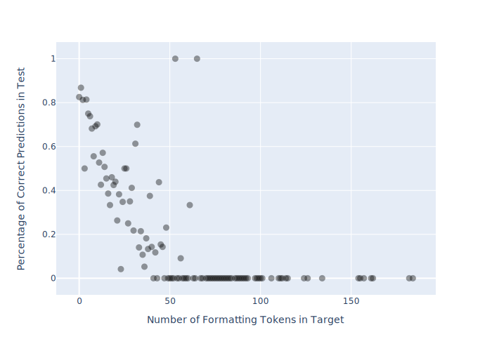

# Results and Evaluation

## Experiment Setup

* NN model: Out-of-the-box OpenNMT Transformer with SelfAttentionDecoder
* Max number of input tokens in training (Diagnostic Message + FILE_CONTENT): 150
* Max number of output tokens in training: 100
* See further NN parameters in [nn/data.yml](nn/data.yml)
* Hardware: Nvidia GeForce GTX 1080
* NN was evaluated on inferring/translating the test dataset
* Input: [src-test.txt](../src-test.txt), correct output: [tgt-test.txt](../tgt-test.txt), predicted output: [inference-test.txt](inference-test.txt)
* Evaluation was scripted in [evaluate_nn_results.py](/evaluate_nn_results.py)
* Evaluation results to be found in [inference-eval.json](inference-eval.json)
* Pearson Number calculated with [scipy.stats.pearsonr](https://docs.scipy.org/doc/scipy/reference/generated/scipy.stats.pearsonr.html)

## Results after 5k steps

Convergence after around 3k steps (1h35min); Loss function:

Measuring the impact of datapoints per diagnostic on its accuracy in the following figure.

pearsonr: (0.10934174253963695, 0.12137157877175254)

Each datapoint represents a diagnostic. It is hard to decipher a correlation between number of data points a diagnostic requires in train to be successfully predicted in test.

Measuring the impact of number of tokens in target/source on success rate of predictions in test in the following figures.

pearsonr: (-0.4050605627269006, 0.00021313425007088403)

pearsonr: (-0.7045310020923062, 1.04662033069795e-24)

Measuring the impact of number of **formatting** tokens in target/source on success rate of predictions in test in the following figures.

pearsonr: (-0.44512400846730865, 6.295775954175408e-05)

pearsonr: (-0.6641921031522395, 1.9171441269825126e-15)
