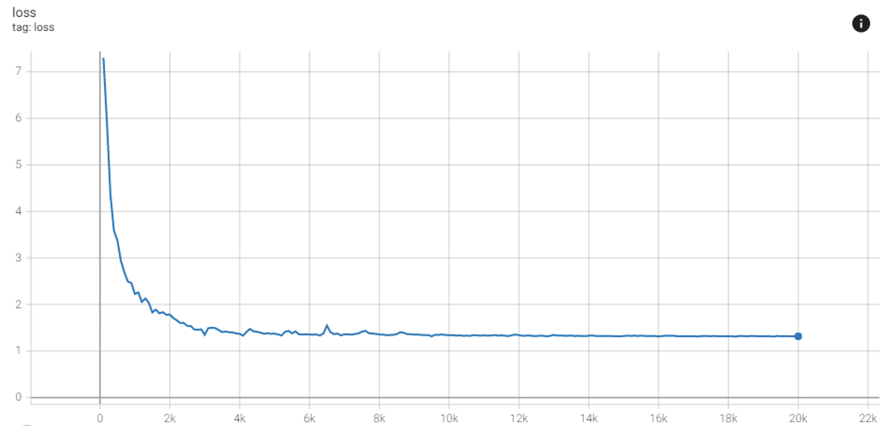
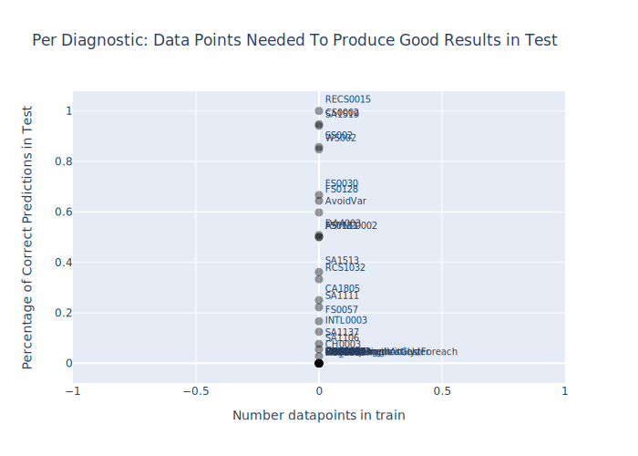
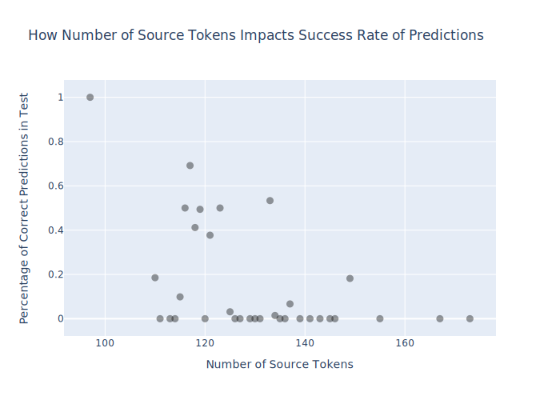
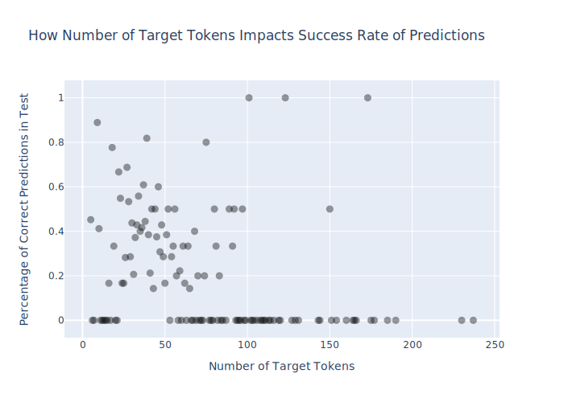
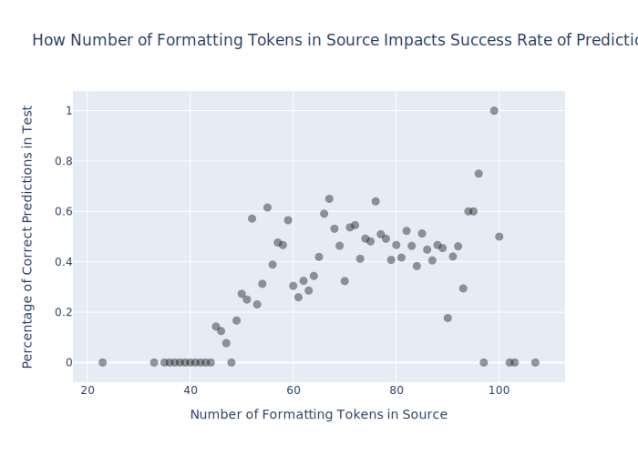
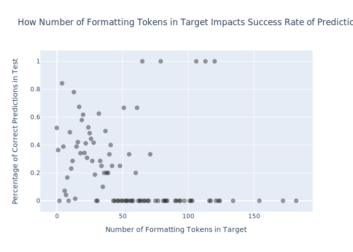

# Results and Evaluation

## Experiment Setup

* NN model: Out-of-the-box OpenNMT Transformer with SelfAttentionDecoder
* Max number of input tokens in training (Diagnostic Message + FILE_CONTENT): 350 (more than largest datapoint)
* Max number of output tokens in training: 500 (more than largest datapoint)
* See further NN parameters in [nn/data.yml](nn/data.yml)
* Hardware: Nvidia GeForce GTX 1080
* NN was evaluated on inferring/translating the test dataset
* Input: [src-test.txt](../src-test.txt), correct output: [tgt-test.txt](../tgt-test.txt), predicted output: [inference-test.txt](inference-test.txt)
* Evaluation was scripted in [evaluate_nn_results.py](/evaluate_nn_results.py)
* Evaluation results to be found in [inference-eval.json](inference-eval.json)

## Results after n steps

Convergence after around n steps (xh ymin); Loss function:

Measuring the impact of datapoints per diagnostic on its accuracy in the following figure.

Each datapoint represents a diagnostic. It is hard to decipher a correlation between number of data points a diagnostic requires in train to be successfully predicted in test.

Measuring the impact of number of tokens in target/source on success rate of predictions in test in the followng figures.

Measuring the impact of number of **formatting** tokens in target/source on success rate of predictions in test in the followng figures.

