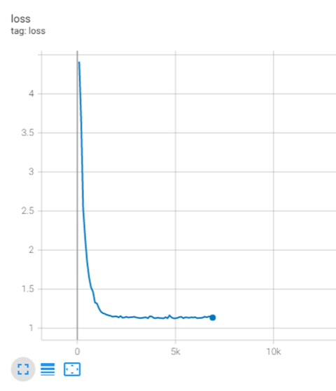
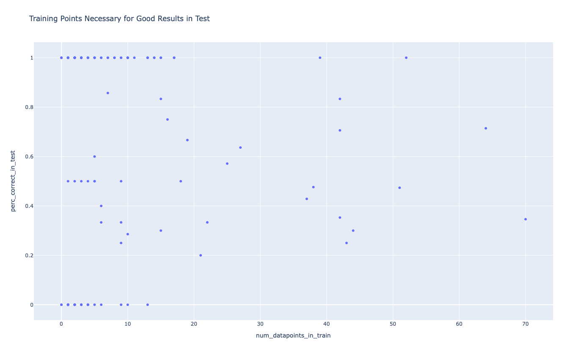

# Final Dataset & Corresponding Results

## Dataset

* Dataset & metadata files generated with [finalize_tokenized_dataset.py](../finalize_tokenized_dataset.py)
* Variable names / identifiers are *not* indexed
* Train, val & test dataset are randomly chosen from aggregate dataset
* See metadata files for further information on data

## Results after 5k steps

* NN was evaluated on inferring/translating the test dataset
* Input: [src-test.txt](src-test.txt), correct output: [tgt-test.txt](tgt-test.txt), predicted output: [inference-test.txt](inference-test.txt)
* Evaluation was scripted in [evaluate_nn_results.py](../evaluate_nn_results.py)
* Evaluation results to be found in [inference-eval.json](inference-eval.json)
* Model used: Out-of-the-box OpenNMT Transformer with SelfAttentionDecoder
* Convergence after around 2k steps (55min) using Nvidia GeForce GTX 1080

Loss function

Measuring the impact of datapoints per diagnostic on its accuracy in the following figure.

Each datapoint represents a diagnostic. It is hard to decipher a correlation between number of data points a diagnostic requires in train to be successfully predicted in test.
